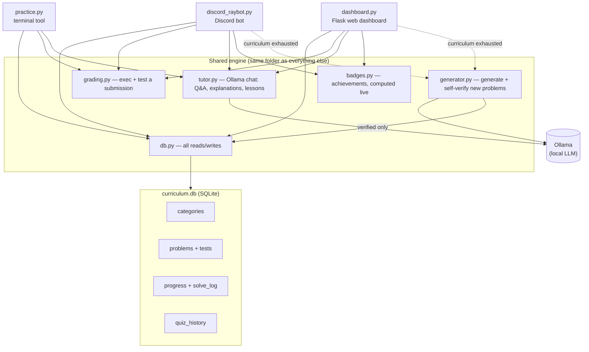

# Raybot — a self-hosted Python learning system

Raybot is a daily Python practice system with three front ends (a terminal
tool, a Discord bot, and a local web dashboard) sharing one SQLite curriculum
that **grows itself**: whenever you run out of problems in a category or
difficulty, a local LLM (via [Ollama](https://ollama.com)) writes a new one —
and has to prove its own reference solution actually passes the tests it
wrote before that problem is ever shown to you. Nothing auto-generated reaches
a learner unverified.

Everything runs locally. No cloud API keys, no subscription, no data leaving
your machine — the only "AI" cost is CPU time from your own Ollama instance.

Every person who uses it — you on the CLI, each Discord user, each dashboard
visitor — gets their own solved/streak/badges. The curriculum is the only
thing that's shared, so a whole cohort can use the same install without
stepping on each other's progress.

## Why

Fixed problem sets run out. A hard-coded curriculum of 28 problems lasts a
couple of weeks at a few a day, and then the tool you built to learn with has
nothing left to teach. Raybot's curriculum is a living database instead of a
list: solve what's there, and when it's not enough, Ollama writes more,
grades its own homework, and only keeps what actually works.

## Architecture



## Features

**Curriculum**
- Categorized problems (basics, loops, strings, recursion, algorithms, OOP, …)
- Each problem ships with a short "concept" lesson shown before the exercise
  (Exercism-style: teach the idea, then ask you to apply it)
- Auto-growing: exhaust a category/difficulty and Raybot generates, tests,
  and verifies a new problem on the spot rather than telling you there's
  nothing left

**Three ways to practice**
- **`practice.py`** — a terminal tool that opens each problem in Notepad and
  re-runs your tests automatically every time you save
- **Discord bot** — `!quiz` posts a race (first correct answer wins, open to
  anyone in the channel), `!firelordray` DMs you a personal 5-question quiz
  filterable by difficulty/category, plus a daily auto-posted race
- **Web dashboard** — an Exercism-inspired local site (Flask) with an
  in-browser code editor, instant grading, and an "Ask Raybot" box for
  free-form questions about whatever you're stuck on

**Feedback that actually teaches**
- Wrong answers get an auto-generated explanation of *what's* wrong and *why*
  — not just a pass/fail count — without ever handing over the fixed code
- "Ask Raybot" answers your questions grounded in the exercise you're
  currently working on

**Progress that motivates — per person**
- Per-user streak, per-category and per-difficulty completion tracking
- Achievement badges (solve counts, streaks, a perfect quiz, winning a race,
  clearing an entire category) — computed live from real state, nothing to
  get out of sync
- A leaderboard across everyone who's solved something (Discord races,
  personal quizzes, and dashboard solves all count, ranked by distinct
  problems solved)
- A GitHub-style activity heatmap of your own last 12 weeks
- Adaptive quiz mode that weights questions toward whichever difficulty
  you've been scoring lowest on recently

**Multi-user by design**
- CLI: identity is your Windows/OS login — zero setup, and it doubles as the
  dashboard's default identity too, so the two stay in sync for you on your
  own machine
- Discord: identity is your real Discord username — already how mentions and
  DMs work, nothing extra needed
- Dashboard: a small "who are you" box in the nav bar sets a display name in
  a long-lived cookie — no password, just enough to keep a shared browser's
  users from overwriting each other's progress
- Race mode (`!quiz`) is the one deliberately *shared* mechanic: once anyone
  wins a race with a problem, it won't be offered again — but the winner
  still only gets credit in their own personal progress

## Project layout

Everything lives in one folder:

```
db.py                     SQLite access layer (the only file that touches curriculum.db)
curriculum.db             categories, problems, tests, per-user progress, solve log, submissions
grading.py                executes a submission and checks it against a problem's tests
generator.py              Ollama-backed problem generation + self-verification
tutor.py                  Ollama-backed Q&A, wrong-answer explanations, lessons
badges.py                 achievement definitions, computed from live db state
practice.py               terminal front end
discord_raybot.py         Discord bot
dashboard.py              Flask web dashboard
grow_curriculum.py        batch script: top up every category to N problems
migrate_to_multiuser.py   one-time migration this repo already ran (kept for reference/re-forks)
```

One folder, one `curriculum.db`, no cross-directory imports — every file
just does `import db` and it resolves locally.

## Setup

Requires Python 3.8+, [Ollama](https://ollama.com) running locally with a
model pulled (developed against `llama3` for generation and `llama3.2:3b`
for chat/tutoring — see `tutor.py`/`generator.py` for why they're split),
and — for the Discord bot — `discord.py` plus a bot token in a local `.env`
(`DISCORD_TOKEN=...`, gitignored).

```bash
# Terminal tool
python practice.py today

# Web dashboard
python dashboard.py          # open http://localhost:5001

# Discord bot
python discord_raybot.py
```

To bulk-generate problems ahead of time instead of waiting for on-demand
generation:

```bash
python grow_curriculum.py    # tops up every category to TARGET_PER_CATEGORY
```

## How generation verification works

1. Ollama is asked for a JSON spec: title, prompt, starter code, test cases,
   and — critically — a **reference solution**.
2. `generator.py` execs that reference solution and runs it against the
   generated tests, in the same sandboxed grading path real submissions use.
3. If the reference solution doesn't pass its own tests (wrong expected
   value, malformed test structure, whatever), the whole spec is discarded
   and regenerated — with the specific failure reason fed back to the model
   so it can self-correct.
4. Only a spec that verifiably works gets a lesson generated and lands in
   `curriculum.db`.

This catches real failure modes, not hypothetical ones — like a model
computing `4+5+6+7+8+9` as `21` instead of `39` when writing its own test
case, or flattening a list-typed parameter's values across several `args`
slots. Both get rejected before they'd ever reach a learner.

## Security notes

Grading works by executing whatever code you (or a Discord user) submit —
that's the only way to check it. A denylist blocks the most obviously
dangerous patterns (file/network/process access, re-entering `eval`/`exec`)
and a timeout bounds runaway loops, but this is **not a sandbox**. The web
dashboard only listens on `localhost`, so that's just you running your own
code. The Discord race mode (`!quiz`) is open to anyone in the channel it's
run in — only enable it in servers with people you actually trust.
