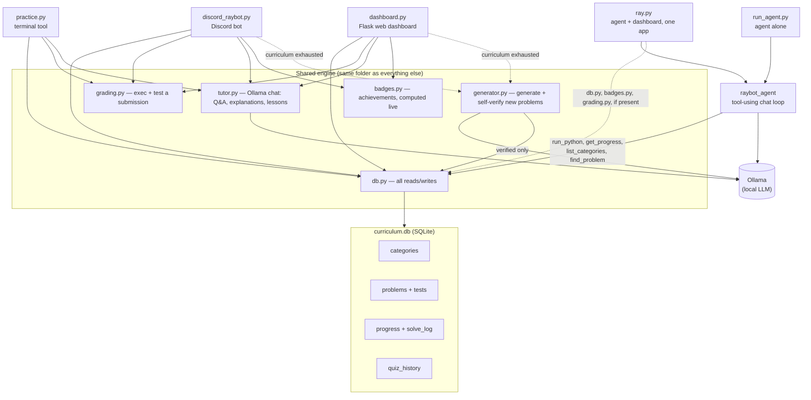

# Raybot — a self-hosted Python learning system

Raybot is a daily Python practice system built around one SQLite curriculum
that **grows itself**: whenever you run out of problems in a category or
difficulty, a local LLM (via [Ollama](https://ollama.com)) writes a new one —
and has to prove its own reference solution actually passes the tests it
wrote before that problem is ever shown to you. Nothing auto-generated reaches
a learner unverified.

There are six ways to run it, all optional. Five listen on `localhost` only;
`dashboard.py` listens on your whole local network while it's running (see
Security notes):

| Run this | Port | What it is |
|---|---|---|
| `practice.py` | — | terminal tool |
| `discord_raybot.py` | — | Discord bot |
| `dashboard.py` | 5001 | web dashboard for the curriculum — LAN-reachable (see Security notes) |
| `run_agent.py` | 5003 | `raybot_agent` alone — a tool-using chat agent |
| `ray.py` | 5000 | the agent as the front page, with the dashboard's stats/problem browser alongside it |
| `raybot_showcase.py` | 5002 | a standalone, dependency-free page about what Raybot can do |

Everything runs locally. No cloud API keys, no subscription, no data leaving
your machine — the only "AI" cost is CPU time from your own Ollama instance.

Every person who uses it — you on the CLI, each Discord user, each dashboard
visitor — gets their own solved/streak/badges. The curriculum is the only
thing that's shared, so a whole cohort can use the same install without
stepping on each other's progress.

## Why

Fixed problem sets run out. A hard-coded curriculum of 28 problems lasts a
couple of weeks at a few a day, and then the tool you built to learn with has
nothing left to teach. Raybot's curriculum is a living database instead of a
list: solve what's there, and when it's not enough, Ollama writes more,
grades its own homework, and only keeps what actually works.

## Architecture



## Features

**Curriculum**
- Categorized problems (basics, loops, strings, recursion, algorithms, OOP, …)
- Each problem ships with a short "concept" lesson shown before the exercise
  (Exercism-style: teach the idea, then ask you to apply it)
- Auto-growing: exhaust a category/difficulty and Raybot generates, tests,
  and verifies a new problem on the spot rather than telling you there's
  nothing left

**Three ways to practice**
- **`practice.py`** — a terminal tool that opens each problem in Notepad and
  re-runs your tests automatically every time you save
- **Discord bot** — `!quiz` posts a race (first correct answer wins, open to
  anyone in the channel), `!firelordray` DMs you a personal 5-question quiz
  filterable by difficulty/category, plus a daily auto-posted race
- **Web dashboard** — an Exercism-inspired local site (Flask) with an
  in-browser code editor, instant grading, and an "Ask Raybot" box for
  free-form questions about whatever you're stuck on

**Feedback that actually teaches**
- Wrong answers get an auto-generated explanation of *what's* wrong and *why*
  — not just a pass/fail count — without ever handing over the fixed code
- "Ask Raybot" answers your questions grounded in the exercise you're
  currently working on

**Progress that motivates — per person**
- Per-user streak, per-category and per-difficulty completion tracking
- Achievement badges (solve counts, streaks, a perfect quiz, winning a race,
  clearing an entire category) — computed live from real state, nothing to
  get out of sync
- A leaderboard across everyone who's solved something (Discord races,
  personal quizzes, and dashboard solves all count, ranked by distinct
  problems solved)
- A GitHub-style activity heatmap of your own last 12 weeks
- Adaptive quiz mode that weights questions toward whichever difficulty
  you've been scoring lowest on recently

**Multi-user in Discord; single-identity everywhere else (corrected after review)**
- Discord: identity is your real Discord username (`str(author)`, recorded on
  every solve/quiz attempt) — already how mentions and DMs work, nothing
  extra needed. This one is genuinely multi-user: each Discord account's
  progress, streak, and quiz history stay separate.
- CLI (`practice.py`): no per-user identity check found — it reads/writes
  the shared curriculum state directly, so whoever runs it on this machine
  shares one progress record with everyone else who also runs it here.
- Dashboard (`dashboard.py`) and the combined agent app (`ray.py`): despite
  earlier docs here claiming a "who are you" cookie-based display name,
  no such mechanism exists in the code — every dashboard submission is
  hardcoded to `user_name="dashboard"` (or `"you"` in `ray.py`). Every
  device that opens the dashboard shares that one identity's solved count,
  streak, and quiz history; on a LAN-shared install (see Security notes)
  that means everyone using it merges into a single progress record, and
  the leaderboard/personal-average features are not meaningful across
  more than one person. If you want real per-browser identity here, that
  cookie-based system would need to actually be built — it currently isn't.
- Race mode (`!quiz`, Discord only) is the one deliberately *shared*
  mechanic: once anyone wins a race with a problem, it won't be offered
  again — but the winner still only gets credit in their own personal
  Discord-identity progress.

## The agent (`raybot_agent`)

The front ends above all revolve around a fixed curriculum you solve. `raybot_agent`
is a different shape: a real tool-calling chat loop against Ollama. Ask it a
question and it **runs tools instead of guessing** — `sum(range(11))` gets
executed and reported as `55`, not estimated; "how am I doing" reads your
actual `curriculum.db` state. Every tool call shows up in the transcript with
its exact arguments and raw result, never hidden.

| Tool | What it does |
|---|---|
| `run_python` | Executes a snippet and returns its output (or a bare trailing expression's value, so no `print()` is needed) |
| `get_progress` | Solved count, percentage, streak, quizzes taken |
| `list_categories` | Every category with its solved/total |
| `find_problem` | Search problems by title or category |

Three ways to reach it:
- **`run_agent.py`** (port 5003) — the agent alone, nothing else
- **`ray.py`** (port 5000) — the agent as the whole point of the app; the
  dashboard's live stats, problem browser, and solve-and-grade view sit
  alongside it, and every curriculum page gets an "Ask Ray" box wired to the
  same agent with that problem as context
- **imported directly** — `agent.run_turn()` has no Flask dependency:
  ```python
  from raybot_agent import run_turn
  reply, trace, history = run_turn([], "What does 2**20 come to?")
  ```

Full detail — tool schemas, the denylist `run_python` runs code through, the
5-round-trip cap, why it needs `llama3.2:3b` specifically and not plain
`llama3` — is in [`raybot_agent/README.md`](raybot_agent/README.md).

**`raybot_showcase.py`** (port 5002) is the odd one out: a static, no-database,
no-Ollama-required page that just describes what the rest of this repo does.
Useful for showing someone the idea without setting anything up first.

## Project layout

Everything lives in one folder:

```
db.py                     SQLite access layer (the only file that touches curriculum.db)
curriculum.db             categories, problems, tests, per-user progress, solve log, submissions
grading.py                executes a submission and checks it against a problem's tests
generator.py              Ollama-backed problem generation + self-verification
tutor.py                  Ollama-backed Q&A, wrong-answer explanations, lessons
badges.py                 achievement definitions, computed from live db state
practice.py               terminal front end
discord_raybot.py         Discord bot
dashboard.py              Flask web dashboard
grow_curriculum.py        batch script: top up every category to N problems
migrate_to_multiuser.py   one-time migration this repo already ran (kept for reference/re-forks)
raybot_agent/             the tool-using chat agent (agent.py, tools.py, web.py) — see its own README
ray.py                    the agent as the front page, dashboard features alongside it, one port
raybot_showcase.py        standalone presentation page, no database or Ollama required
run_agent.py              entry point for raybot_agent's own web UI
```

One folder, one `curriculum.db`, no cross-directory imports — every file
just does `import db` and it resolves locally. The exception is `dashboard.py`,
`ray.py`, and `discord_raybot.py`, which currently import `badges`/`db`/
`generator`/`grading`/`tutor` from a hardcoded external path
(`C:\Users\rayra\Documents\python-practice` on the machine this was built on)
rather than the copies of those same files sitting right here — a known,
not-yet-cleaned-up wrinkle if you clone this repo somewhere else.

## Setup

Requires Python 3.8+, [Ollama](https://ollama.com) running locally with a
model pulled (developed against `llama3` for generation and `llama3.2:3b`
for chat/tutoring — see `tutor.py`/`generator.py` for why they're split),
and — for the Discord bot — `discord.py` plus a bot token in a local `.env`
(`DISCORD_TOKEN=...`, gitignored).

```bash
# Terminal tool
python practice.py today

# Web dashboard
python dashboard.py          # open http://localhost:5001, or http://<lan-ip>:5001 from another device

# Discord bot
python discord_raybot.py

# The agent alone (needs a tool-capable model: ollama pull llama3.2:3b)
python run_agent.py          # open http://localhost:5003

# The agent as the front page, dashboard features alongside it
python ray.py                # open http://localhost:5000

# Static showcase page — no Ollama or database required
python raybot_showcase.py    # open http://localhost:5002
```

To bulk-generate problems ahead of time instead of waiting for on-demand
generation:

```bash
python grow_curriculum.py    # tops up every category to TARGET_PER_CATEGORY
```

## How generation verification works

1. Ollama is asked for a JSON spec: title, prompt, starter code, test cases,
   and — critically — a **reference solution**.
2. `generator.py` execs that reference solution and runs it against the
   generated tests, in the same sandboxed grading path real submissions use.
3. If the reference solution doesn't pass its own tests (wrong expected
   value, malformed test structure, whatever), the whole spec is discarded
   and regenerated — with the specific failure reason fed back to the model
   so it can self-correct.
4. Only a spec that verifiably works gets a lesson generated and lands in
   `curriculum.db`.

This catches real failure modes, not hypothetical ones — like a model
computing `4+5+6+7+8+9` as `21` instead of `39` when writing its own test
case, or flattening a list-typed parameter's values across several `args`
slots. Both get rejected before they'd ever reach a learner.

## Security notes

Grading works by executing whatever code you (or a Discord user) submit —
that's the only way to check it. A denylist blocks the most obviously
dangerous patterns (file/network/process access, re-entering `eval`/`exec`)
and a timeout bounds runaway loops, but this is **not a sandbox**. `dashboard.py`
binds to `0.0.0.0`, so it's reachable from every device on your local network
(not the open internet — that would additionally need a router port-forward)
while it's running: only run it when you mean to share it, and only on a
network where everyone who can reach it is someone you'd trust to run code on
this machine. The Discord race mode (`!quiz`) is open to anyone in the channel
it's run in — only enable it in servers with people you actually trust.

The agent's `run_python` tool is a different risk profile from the above: it
executes code the **model** chose to write, not code a person typed, using
the same denylist-plus-timeout approach (not a sandbox there either — a
runaway loop it hands `run_python` keeps a core busy on a daemon thread until
the process exits, since Python can't forcibly kill a thread). Run the agent,
`ray.py`, and `run_agent.py` on `localhost` for yourself; don't expose any of
them.
